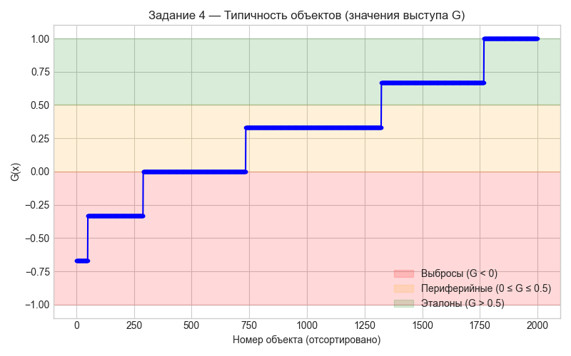

# 🧠 Лабораторная работа №3 — Метрические алгоритмы, выступ, типичность, проклятие размерности
  
**Автор:** Альберт  
**Год:** 2025  
**Тема:** KNeighborsClassifier / KNeighborsRegressor / Типичность объектов / Проклятие размерности  

---

## 📦 Установка зависимостей

Перед запуском убедитесь, что у вас установлен Python 3.10+  
и выполните установку необходимых библиотек:

```bash
pip install pandas numpy scikit-learn matplotlib openpyxl
```

## Запуск проекта 

```bash
python lab3.py
```

*После выполнения все графики автоматически сохраняются в папку:*
```bash
figures/
```

## Пример графика


## 📊 Основные графики и их назначение

| Файл                                    | Описание                                                               |
| --------------------------------------- | ---------------------------------------------------------------------- |
| **lab3_task1_knn_errors.png**           | Ошибки на train/test при разных `n_neighbors` для KNeighborsClassifier |
| **lab3_task2_n_neighbors.png**          | Влияние параметра `n_neighbors` на прогноз KNeighborsRegressor         |
| **lab3_task2_weights.png**              | Сравнение `weights='uniform'` и `weights='distance'`                   |
| **lab3_task2_comparison.png**           | Сравнение KNeighborsRegressor и RadiusNeighborsRegressor               |
| **lab3_task3_dimensionality_curse.png** | Демонстрация "проклятия размерности" через распределение расстояний    |
| **lab3_task4_typicality_zones.png**     | Типичность объектов с выделением зон: выбросы, периферийные, эталоны   |


# 🧩 Краткие пояснения по заданиям

## ⚙️ **Задание 1. KNeighborsClassifier**

- Используется **нормализация признаков** через `StandardScaler`.  
- Построена зависимость **ошибок Train/Test** от количества соседей `n_neighbors`.  
- **Оптимальное значение** *k ≈ 6*.  
- При **малых k** наблюдается *переобучение*,  
  а при **больших k** — *недообучение*.

---

## 📈 **Задание 2. KNeighborsRegressor**

- Моделируется регрессия по признаку **Solidity**.  
- Для точек на отрезке [A, B] (10–90% квантилей) показано влияние:
  - числа соседей **`n_neighbors`**;
  - функции весов **`weights`**;
  - различие между **`KNeighborsRegressor`** и **`RadiusNeighborsRegressor`**.  

- При увеличении *k* прогноз становится **более сглаженным**,  
  но теряет детализацию.

---

## 🧩 **Задание 3. Проклятие размерности**

- В малых размерностях расстояния между точками **существенно различаются**.  
- В высоких размерностях все расстояния становятся **почти одинаковыми**,  
  из-за чего “ближайшие соседи” **теряют смысл**.  
- На гистограмме видно, что **распределение расстояний сжимается** с ростом размерности.

---

## 🔍 **Задание 4. Типичность объектов**

- Вычислены значения выступа *G(x)* для каждого объекта:  
  \[
  G_i = 2P_{\text{true}} - 1
  \]

- Добавлено **цветовое разделение по типичности**:
  - 🔴 *Выбросы* — G < 0  
  - 🟠 *Периферийные* — 0 ≤ G ≤ 0.5  
  - 🟢 *Эталоны* — G > 0.5  

- Критерий **крутого склона** *не выполняется* —  
  кривая плавная, что означает **отсутствие выраженных выбросов** в данных.

---

## 💡 **Выводы**

- **Нормализация данных** критически важна для метрических алгоритмов.  
- **Оптимальное число соседей** (*k = 6*) обеспечивает баланс между *bias* и *variance*.  
- *Проклятие размерности* подтверждено — в высоких пространствах расстояния теряют различимость.  
- **Выступ G** позволяет визуально разделить *эталонные* и *нетипичные* объекты.  
- Модель демонстрирует **устойчивость** и отсутствие выраженных выбросов по типичности.

---
## 🪪 License

*MIT License — свободное использование кода с указанием автора.*
